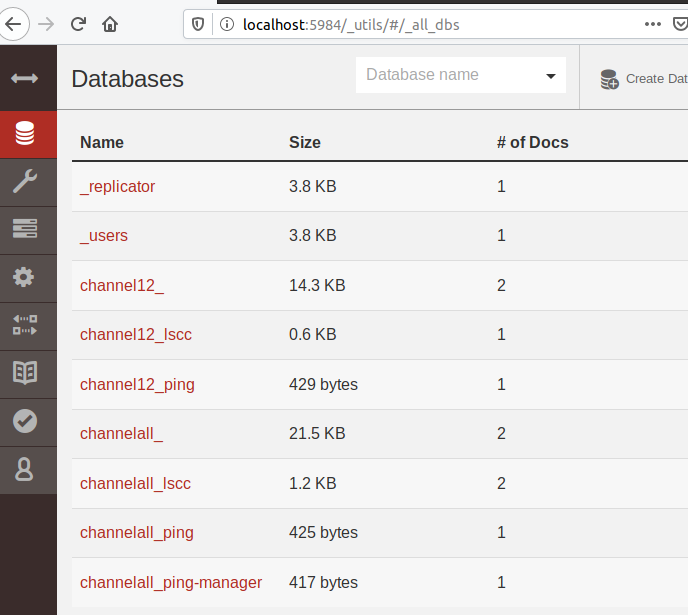

TODO:
 * wolanie na channelu, ktory nie ma zainstalowanego chaincode
 * pokazać proste wywołanie   - przenieść do skryptów

co  chciałbym pokazać:
- jak wołać chaincode
- jak wołać chaincode z chaincode i jakie daje Nam to gwarancje spójności:
    - na tym samym channel
    - na innym channel       
- jak inny chaincode może mieć dostęp do danych 
- jak chaincody współdzielą się danymi - aka wspólna kolekcja
       

# Próba napisania artykułu

### Komunkacja z HLF

Publiczne blockchainy takie jak Ethereum pozwalają wgrywać kontrakty, które pozwalają na pisanie logiki jak powinien zachować się blockchain w przypadku otrzymania requestu. Ich rezultat zapisywany jest na blochainie, który jest jeden i wspólny dla wszystkich kontraktów. HLF natomiast pozwala na tworzenie w ramach jednej sieci wielu łańcuchów, gdzie każdy z nich działa niezależnie. Ponadto tak jak Ethereum pozwala na każdy taki łańcuch wgrywać dowolną ilość kontraktów. 

W tym artykule będę się starał ukazać w jaki sposob można wywoływać kontrakty na blockchainie i jaki wpływ na konsystencje danych ma wywoływanie kontraktów na tym samym jak i na różnym łańcuchu.

### Kilka słówek z HLF

Jeżeli znasz już HLF możesz śmiało pominąć ten akapit.

Dla tych, którzy nie czują się jeszcze komfortowo z HLF przedstawię kilka pojęć ze świata HLF, które pomogą zrozumieć artykuł. Pamiętajcie jednak, że są to pobieżne definicje, za każdym z nich kryje się ogromna logika i każde zasługuje na osobny artykuł ;) Pojęcia prezentuje w formie listy aby łatwo było wrócić ;)

* Channel - jest to lańcuch bloków
* Network - set of channels
* Chaincode - jest tym samym co w Ethereum smart contract, czyli kodem programu wykonywanym bezpośrednio na bloku.  
* peer - serwis, do którego wgrywa się Chaincode. 
* orderer - serwis, zatwierdzający transakcje
* CA - serwis odpowiedzialny za autentykacje użytkowników, trzyma ich certyfikaty.

### Opis środowiska

MAmy 2 channele:
* channel 1, na którym jest zdeployowany `ping` oraz `zing`
* channel 2, na którym jest zdeployowany `ping`

### First  <strike>blood</strike> request  

##### TODO pokazać proste wywołanie  

Jako pierwszy wywołamy chaincode: `ping` channelu pierwszym. 

```
$PEER1_EXEC peer chaincode invoke -C $CHANNEL_ONE_NAME -n $CHAINCODE_NAME -c '{"Args":["com.devcat.ping:putSomething", "slk", "123"]}' --tls --cafile $ORDERER_TLS_CERT
```

```
$PEER3_EXEC peer chaincode query -C $CHANNEL_ONE_NAME -n $CHAINCODE_NAME -c '{"Args":["com.devcat.ping:getSomething", "slk"]}' --tls --cafile $ORDERER_TLS_CERT
```
Powyższe wywolanie generuje następujący rezultat: 
```
Result for key is 123
```

Co się jednak wydarzy, gdy na tym samym channellu, ale dla innego Chaincode wywołamy zapytanie:
```
$PEER3_EXEC peer chaincode query -C $CHANNEL_ONE_NAME -n $CHAINCODE_NAME_2 -c '{"Args":["com.devcat.ping:getSomething", "slk"]}' --tls --cafile $ORDERER_TLS_CERT
```
i jako wynik otrzymujemy
```
NO RESULT FOR KEY
```

Jak widać oba chaincody pomimo przechowywania danych pod jednym kluczem nie dzielą domyślnie stanu 
Dzieje się tak ponieważ dla każdego zainstalowanego chaincodu istnieje osobna baza, co można łatwo sprawdzić w couchDB:
 http://localhost:5984/_utils/#/_all_dbs  
 

 
### 
możemy querować inne chaincody na tym samym kanale `01_takeValueFromOtherChaincode.sh`

lepiej możemy querować inne chaincody na innym kanale `02_takeValueFromOtherChannel.sh`

jeszcze lepiej możemy wywolywać inne kontrakty na tym samym kanal `03_putValueToOtherChaincodel.sh`

i wogole extra rewelacja możemy wywoływać inne kontrakty na innych kanałach `04_putValueToOtherChannel.sh` , a jednak nie.. 
To znaczy można wywolać jednak rezultat nie zostanie zapisany na blockchainie. Dzieje się tak, ponieważ Hyperledger pomija 
operacja wykonywane na innych kanałach w rezultacie. 

W tym calym optymiźmie warto też zwrócić, że wyołanie jak i querowanie dowolnego chaincode na tym samym kanale zachowuje gwarancje 
jakie daje Nam Fabric, czyli:
* jeżeli, któraś z modyfikowanych wartości zmieniła się między wywołaniem a zapisaniem danych. Transakcja jest odrzucana.
* jeżeli transakcja modyfikuje dane, ale jednocześnie woła inny chaincode o dane i dane na tym innym chaincodzie zostaną zmodyfikowane cała. Transakcja jest odrzucana.

W przypadku wywoływania chaincode na innym kanale. Jedyna gwarancja HLF-a, która może odnaleźć nieprawidłowości to walidacja i  porównywanie odpowiedzi 
ze wszystkich endorser peerów. Jeżeli któryś z peerów zwróci inną odpowiedź, cała transakcja jest odrzucana.

To prowadzi do kolejnego wniosku. Jeżeli chaincode wykonuje jakąś akcję, ktorej rezultat nie zależy tylko od parametrów wejściowych 
(np. zależy od czasu, wywoluje random). Transakcja zostanie odrzucona przez orderera, ponieważ peery albo zmodyfikuj wartość 
zależną od niedeterministycznych wartości albo zwrócą różne odpowiedzi. patrz `05_putTime.sh` oraz `06_putValueAndTime.sh`

   

  ####każdy peer powinien mieć swoją bazę

### na koniec     


jeżeli nie podamy pełnej nazwy kontraktu w wywolaniu `query` albo `invoke` 
wtedy kolejność Kontraktow w `src/index.ts` decyduje z którego kontraktu metoda zostanie wywołana

